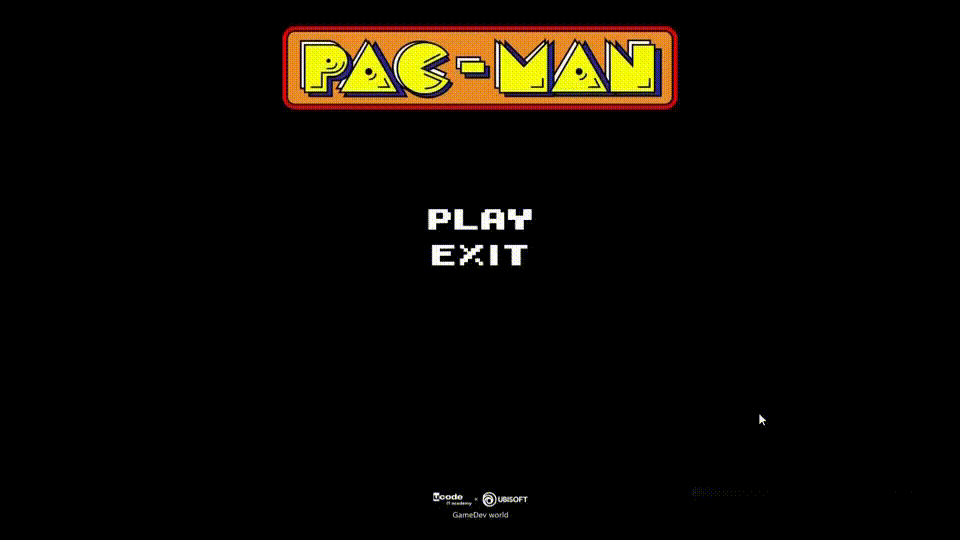
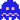

# UMazeGame
***
Pac-Man has already celebrated his 40th Anniversary.\
It is an action maze chase video game.
While going through the maze, you are trying to avoid those tricky ghosts, 
eat all of the dots to advance to the next level and eat bonus items for bonus points.\
To sum up, I want you to delve into the atmosphere of one of the best arcade games and enjoy my trial version of it!


# Game process




# For Developers
### Data access information
- MiniKit Framework is protected by copyright

## Setup
1. Download or clone the source code
2. `cd` into the directory
3. Build:
```bash
## on Windows
build_win32_vs2019.bat

```
5. Run:
```bash
## on Windows 
./build_win32/game/src/Debug/maze.exe
```


# Project structure

```
CMakeLists.txt
├── engine
    CMakeLists.txt
    ├── external        # libs
        CMakeLists.txt
    ├── minikit          # framework
        CMakeLists.txt
    └── src            # sources
├── game
    CMakeLists.txt
    ├── assets          # multimedia assets
    └── src            # sources
        CMakeLists.txt

```


# Usage
The controls:
* <kbd>←</kbd> <kbd>→</kbd> <kbd>↑</kbd> <kbd>↓</kbd> : manipulate Pac-Man to move to the left, right, up or down
* <kbd>Esc</kbd> : Exit the game


## Authors

* **Yevheniia Ksonzenko** - [GitHub page](https://github.com/yksonzenko)